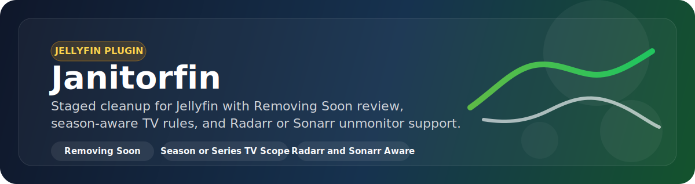

<h1 align="center">Janitorfin</h1>
<h2 align="center">A Jellyfin Plugin</h2>

<p align="center">
  
</p>

<p align="center">
  <a href="https://github.com/Exor-o7/Janitorfin">
    
  </a>
  <a href="https://github.com/Exor-o7/Janitorfin/releases">
    
  </a>
  <a href="https://github.com/Exor-o7/Janitorfin/issues">
    
  </a>
</p>

<p align="center">
  <a href="https://github.com/Exor-o7/Janitorfin">Repository</a>
  |
  <a href="https://github.com/Exor-o7/Janitorfin/releases">Releases</a>
  |
  <a href="https://github.com/Exor-o7/Janitorfin/issues">Issues</a>
  |
  <a href="https://github.com/Exor-o7/Janitorfin/releases/latest/download/Janitorfin.zip">Latest Plugin Zip</a>
</p>

## Introduction

Janitorfin is a Jellyfin-native cleanup plugin for automatically finding stale media, staging it for review, and eventually deleting it once it still matches your retention rules after a grace period.

The plugin is intentionally closer to a Jellyfin-first equivalent of the cleanup workflows people typically use with tools like Maintainerr or Media Cleaner, but with native Jellyfin configuration, scheduled execution, pending review, and optional Radarr or Sonarr coordination.

## Features

- Native Jellyfin plugin with an embedded admin settings page
- Preview matching candidates before running cleanup
- Dry-run mode for validating rules without deleting anything
- Pending deletion queue with configurable grace period
- Review surface via the Jellyfin collection `Removing Soon`
- Optional integration with Home Screen Sections for a `Removing Soon` row
- Radarr unmonitor support for movies deleted by Janitorfin
- Sonarr unmonitor support for TV deletions with selectable episode, season, or series scope
- Separate movie and TV cleanup rules
- TV cleanup scope that can match by season or entire series
- Favorite protection and protected-tag exclusion support
- Library-specific rule overrides

## How It Works

### Cleanup Flow

1. Janitorfin scans movies, TV episodes, and videos in Jellyfin.
2. It evaluates each item against your configured watched and never-watched retention rules.
3. Matching items are either:
   - queued for staged deletion, or
   - deleted immediately if pending deletion is disabled.
4. If Radarr or Sonarr integration is enabled, Janitorfin updates monitoring before deletion so content is not immediately reacquired.

### TV Matching

TV cleanup is evaluated per episode first, then applied using the selected TV cleanup scope:

- `Season`
  - Janitorfin only stages or deletes episodes from a season if every evaluated episode in that season is eligible.
- `Series`
  - Janitorfin only stages or deletes episodes from a show if every evaluated episode in the show is eligible.

`Season` is the recommended default for most libraries because TV content is usually managed and reacquired at season scope rather than per-episode.

### Review Before Delete

When pending deletion is enabled, Janitorfin does not delete matching items immediately.

- Matching items are added to the pending queue.
- They remain reviewable for the configured grace period.
- If they are watched or favorited during that window and no longer match the rules, they are spared.
- If they still match after the grace period, the next live cleanup run deletes them.

## Installation

### Prerequisites

- Jellyfin `10.11.6`
- Plugin target framework `net9.0`

### Install From Releases

1. Download the latest packaged plugin zip from [GitHub Releases](https://github.com/Exor-o7/Janitorfin/releases/latest) or directly from [Janitorfin.zip](https://github.com/Exor-o7/Janitorfin/releases/latest/download/Janitorfin.zip).
2. Extract the contents into your Jellyfin plugin directory, for example `plugins/Janitorfin`.
3. Restart Jellyfin.
4. Open Dashboard > Plugins > Janitorfin to configure rules.

### Install From Local Build

1. Build or publish the plugin.
2. Optionally package it as `Janitorfin.zip` using the workspace task in `.vscode/tasks.json`.
3. Copy the published output from `artifacts/publish/Janitorfin` into your Jellyfin plugins directory.
4. Restart Jellyfin.
5. Open the Janitorfin plugin page from the Jellyfin dashboard.

## Configuration

### Cleanup Options

- `Protected tag`
  - Any item with this Jellyfin tag is skipped.
- `Keep favorites`
  - Any item favorited by any Jellyfin user is skipped.
- `Dry run`
  - Logs and previews actions without deleting media or touching monitoring in Radarr or Sonarr.
- `Pending deletion grace days`
  - Controls how long items remain staged before a later live run deletes them.

### Movie Rules

- `Watched days`
  - Delete a movie after it has been watched and remains untouched for this many days.
- `Never-watched days`
  - Delete a movie after this many days since added if it has never been watched.

### TV Show Rules

- `TV cleanup match scope`
  - Choose whether TV cleanup should be decided at `Season` or `Series` scope.
- `Watched days`
  - Applies to episode eligibility before scope grouping is enforced.
- `Never-watched days`
  - Applies to episode eligibility before scope grouping is enforced.

### Radarr

- Optionally unmonitor deleted movies in Radarr to prevent reacquisition.

### Sonarr

- Optionally unmonitor deleted TV content in Sonarr.
- `Sonarr unmonitor scope` is separate from TV cleanup match scope.
- Recommended default is `Season` for most TV libraries.

## Review Surfaces

### Removing Soon Collection

Janitorfin always mirrors pending items into a Jellyfin collection called `Removing Soon`.

This gives users a normal Jellyfin-native place to browse items at risk, watch them, or favorite them before deletion.

### Home Screen Sections Integration

If the Home Screen Sections plugin is installed, Janitorfin can optionally register a `Removing Soon` row using reflection-based integration.

If Home Screen Sections is not installed, Janitorfin still works normally and continues to use the `Removing Soon` collection as the fallback review experience.

## Development

### Build

```powershell
dotnet build .\Janitorfin.Plugin\Janitorfin.Plugin.csproj -c Release
```

### Publish

```powershell
dotnet publish .\Janitorfin.Plugin\Janitorfin.Plugin.csproj -c Release -o .\artifacts\publish\Janitorfin
```

### Workspace Notes

- Solution file: `Janitorfin.slnx`
- Main plugin project: `Janitorfin.Plugin/Janitorfin.Plugin.csproj`
- Embedded admin page: `Janitorfin.Plugin/Configuration/configPage.html`

## Known Behavior

- TV cleanup matching only produces candidates when every episode in the chosen season or series scope is eligible.
- Pending deletion is the safest operating mode and is enabled by default.
- Sonarr and Radarr updates only run during live cleanup, not dry-run preview.
- Home Screen Sections integration is optional and non-fatal if the plugin is absent.

## Contribution

Contributions are welcome, especially around:

- Better candidate explanations in preview output
- Additional cleanup rules and exceptions
- Improved review UX
- More robust test coverage for TV grouping behavior
- Packaging and release automation