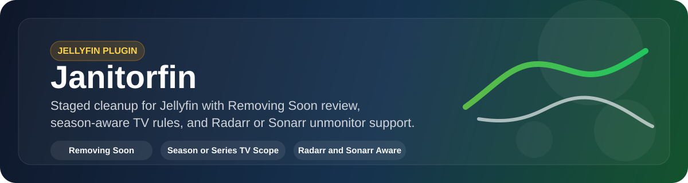

<h1 align="center">Janitorfin</h1>
<h2 align="center">A Jellyfin Plugin</h2>

<p align="center">
  
</p>

<p align="center">
  <a href="https://github.com/Exor-o7/Janitorfin">
    
  </a>
  <a href="https://github.com/Exor-o7/Janitorfin/actions/workflows/ci.yml">
    
  </a>
  <a href="https://github.com/Exor-o7/Janitorfin/releases">
    
  </a>
  <a href="https://github.com/Exor-o7/Janitorfin/issues">
    
  </a>
</p>

<p align="center">
  <a href="https://github.com/Exor-o7/Janitorfin">Repository</a>
  |
  <a href="https://github.com/Exor-o7/Janitorfin/releases">Releases</a>
  |
  <a href="https://github.com/Exor-o7/Janitorfin/issues">Issues</a>
  |
  <a href="https://github.com/Exor-o7/Janitorfin/releases/latest/download/Janitorfin.zip">Latest Plugin Zip</a>
  |
  <a href="https://raw.githubusercontent.com/Exor-o7/Janitorfin/main/manifest.json">Plugin Repository Manifest</a>
</p>

## Introduction

Janitorfin is a Jellyfin-native cleanup plugin by Exor.dev for automatically finding stale media, staging it for review, and eventually deleting it once it still matches your retention rules after a grace period.

The plugin is intentionally closer to a Jellyfin-first equivalent of the cleanup workflows people typically use with tools like Maintainerr or Media Cleaner, but with native Jellyfin configuration, scheduled execution, pending review, and optional Radarr or Sonarr coordination.

## Features

- Native Jellyfin plugin with an embedded admin settings page
- Preview matching candidates before running cleanup
- Dry-run mode for validating rules without deleting anything
- Pending deletion queue with configurable grace period
- Review surface via the Jellyfin collection `Removing Soon`
- Optional integration with Home Screen Sections for a `Removing Soon` row
- Optional Discord notifications for items currently in the grace period
- Optional Jellystat integration for more complete watch-history detection
- Separate scheduled tasks for scanning media and deleting overdue pending items
- Radarr unmonitor support for movies deleted by Janitorfin
- Sonarr unmonitor support for TV deletions with season or series scope
- Separate movie and TV cleanup rules
- TV cleanup scope that can match by season or entire series
- Favorite protection and protected-tag exclusion support
- Library-specific rule overrides

## How It Works

### Basic Workflow

Janitorfin is designed around a review-first cleanup process:

1. Adjust your cleanup settings.
2. Use `Refresh Preview` to see what currently qualifies.
3. Run `Scan Pending Now` to add qualifying media to the pending deletion list.
4. Review the pending list in Janitorfin or in the Jellyfin collection called `Removing Soon`.
5. After the grace period has passed, run `Delete Due Pending Now` to delete only overdue pending items.

This keeps the expensive scan separate from the actual delete step. It also makes it easier to schedule scanning and deletion at different times.

### Preview

Preview shows what would qualify using the settings currently shown on the page.

Preview does not change the pending list, delete media, or update Radarr or Sonarr. It is safe to use while tuning rules.

### Scan Pending Deletions

`Scan Pending Now` runs the scheduled task `Janitorfin Scan Pending Deletions`.

This task scans movies, TV episodes, and videos in Jellyfin. It evaluates them against your rules and updates the pending deletion list.

- Newly qualified media is added to the pending list.
- Media that no longer qualifies is removed from the pending list.
- The `Removing Soon` collection is updated.
- Discord grace-period notifications can be sent if enabled.

If `Dry run` is enabled, the task reports what would happen but does not change the pending list.

### Delete Due Pending Items

`Delete Due Pending Now` runs the scheduled task `Janitorfin Delete Due Pending Items`.

This task does not run a full media scan. It reads the saved pending deletion list and deletes only entries whose saved grace deadline has passed.

Before deleting, Janitorfin still performs lightweight safety checks:

- If the item no longer exists, it is removed from the pending list.
- If the item now has the protected tag, it is removed from the pending list instead of deleted.
- If `Keep favorites` is enabled and any Jellyfin user has favorited the item, it is removed from the pending list instead of deleted.
- If Radarr or Sonarr integration is enabled, Janitorfin updates monitoring before deletion.

If `Dry run` is enabled, the task reports which pending items are due but does not delete anything.

### TV Matching

TV cleanup is evaluated per episode first, then applied using the selected TV cleanup scope:

- `Season`
  - Janitorfin only stages or deletes episodes from a season if every evaluated episode in that season is eligible.
- `Series`
  - Janitorfin only stages or deletes episodes from a show if every evaluated episode in the show is eligible.

`Season` is the recommended default for most libraries because TV content is usually managed and reacquired at season scope rather than per-episode.

### Review Before Delete

When pending deletion is enabled, Janitorfin does not delete matching items immediately.

- Matching items are added to the pending queue.
- They remain reviewable for the configured grace period.
- A later `Scan Pending Deletions` task can remove items from the queue if they no longer match the rules.
- A later `Delete Due Pending Items` task deletes only items whose saved grace deadline has passed.

The grace deadline is saved when an item is first added to the pending list. Changing the grace-days setting affects newly queued items, but it does not automatically rewrite deadlines for items already pending.

## Installation

### Prerequisites

- Jellyfin `10.11.6`
- Plugin target framework `net9.0`

### Install From Releases

1. Download the latest packaged plugin zip from [GitHub Releases](https://github.com/Exor-o7/Janitorfin/releases/latest) or directly from [Janitorfin.zip](https://github.com/Exor-o7/Janitorfin/releases/latest/download/Janitorfin.zip).
2. Extract the contents into your Jellyfin plugin directory, for example `plugins/Janitorfin`.
3. Restart Jellyfin.
4. Open Dashboard > Plugins > Janitorfin to configure rules.

### Install Through A Jellyfin Repository

Use this repository manifest URL in Jellyfin to let the server resolve Janitorfin metadata and detect updates:

`https://raw.githubusercontent.com/Exor-o7/Janitorfin/main/manifest.json`

1. Add the repository manifest URL above in Jellyfin's plugin repositories settings.
2. Refresh repositories.
3. Install or update Janitorfin from the repository entry instead of relying only on a manual zip install.

The release workflow keeps this manifest updated automatically for future tagged releases.

### Automatic Releases

- Pushes and pull requests run the `CI` workflow automatically.
- Version tags like `v1.0.3` run the `Release` workflow automatically.
- The release workflow builds the plugin, packages `Janitorfin.zip`, creates a GitHub Release, and uploads the zip asset.
- Regular CI runs also upload `Janitorfin.zip` as a workflow artifact for testing before an official release.

### Install From Local Build

1. Build or publish the plugin.
2. Optionally package it as `Janitorfin.zip` using the workspace task in `.vscode/tasks.json`.
3. Copy the published output from `artifacts/publish/Janitorfin` into your Jellyfin plugins directory.
4. Restart Jellyfin.
5. Open the Janitorfin plugin page from the Jellyfin dashboard.

## Configuration

### Admin Page Layout

The Janitorfin settings page is split into two main areas:

- The left side contains cleanup rules and integration settings.
- The right side contains `Preview`, `Cleanup`, and `Pending List` tabs.

Use the tabs like this:

- `Preview`
  - Shows media that currently qualifies under the settings on the page.
- `Cleanup`
  - Starts the scan or delete scheduled tasks.
- `Pending List`
  - Shows media already staged for deletion and its grace-period status.

### Cleanup Options

- `Protected tag`
  - Any item with this Jellyfin tag is skipped.
- `Keep favorites`
  - Any item favorited by any Jellyfin user is skipped.
- `Dry run`
  - Reports what Janitorfin would do without changing the pending list, deleting media, or touching monitoring in Radarr or Sonarr.
- `Pending deletion grace days`
  - Controls how long newly queued items remain staged before they become eligible for the delete-due task.
- `Discord grace-period notifications`
  - Sends a Discord webhook message with media currently waiting in the grace period when the scan task runs.
- `Home Screen Sections integration`
  - Adds a `Removing Soon` row to the Jellyfin home screen if the Home Screen Sections plugin is installed.

### Movie Rules

- `Watched days`
  - Delete a movie after it has been watched and remains untouched for this many days.
- `Never-watched days`
  - Delete a movie after this many days since added if it has never been watched.

### TV Show Rules

- `TV cleanup match scope`
  - Choose whether TV cleanup should be decided at `Season` or `Series` scope.
- `Watched days`
  - Applies to episode eligibility before scope grouping is enforced.
- `Never-watched days`
  - Applies to episode eligibility before scope grouping is enforced.

### Radarr

- Optionally unmonitor deleted movies in Radarr to prevent reacquisition.

### Sonarr

- Optionally unmonitor deleted TV content in Sonarr.
- `Sonarr unmonitor scope` is separate from TV cleanup match scope.
- Available scopes are `Season` and `Series`.
- Recommended default is `Season` for most TV libraries.
- `Season` scope unmonitors the deleted season and the parent series to prevent future grabs.
- `Series` scope unmonitors the entire show.

### Jellystat

Jellystat integration is optional. When enabled, Janitorfin can use Jellystat playback history in addition to Jellyfin user data when deciding if media has been watched.

- `Jellystat watched threshold percent`
  - Controls how much playback counts as watched.
- `Jellystat max history pages`
  - Limits how much Jellystat history Janitorfin reads during a scan.

## Review Surfaces

### Removing Soon Collection

Janitorfin always mirrors pending items into a Jellyfin collection called `Removing Soon`.

This gives users a normal Jellyfin-native place to browse items at risk, watch them, or favorite them before deletion.

### Home Screen Sections Integration

If the Home Screen Sections plugin is installed, Janitorfin can optionally register a `Removing Soon` row using reflection-based integration.

If Home Screen Sections is not installed, Janitorfin still works normally and continues to use the `Removing Soon` collection as the fallback review experience.

### Jellyfin Activity Log

Janitorfin adds grouped activity log entries when media is queued for pending deletion and when media is deleted. TV entries are grouped by the selected TV cleanup scope so the dashboard stays readable.

## Development

### Build

```powershell
dotnet build .\Janitorfin.Plugin\Janitorfin.Plugin.csproj -c Release
```

### Publish

```powershell
dotnet publish .\Janitorfin.Plugin\Janitorfin.Plugin.csproj -c Release -o .\artifacts\publish\Janitorfin
```

### Release

1. Update the plugin version in `Janitorfin.Plugin/Janitorfin.Plugin.csproj`.
2. Commit and push your changes.
3. Create and push a version tag such as `v1.0.3`.
4. Make sure the git tag matches the plugin project version exactly.
5. GitHub Actions will create the release, upload `Janitorfin.zip`, and refresh the Jellyfin repository manifest automatically.

### Workspace Notes

- Solution file: `Janitorfin.slnx`
- Main plugin project: `Janitorfin.Plugin/Janitorfin.Plugin.csproj`
- Embedded admin page: `Janitorfin.Plugin/Configuration/configPage.html`

## Known Behavior

- TV cleanup matching only produces candidates when every episode in the chosen season or series scope is eligible.
- Pending deletion is the safest operating mode and is enabled by default.
- Sonarr and Radarr updates only run during live delete tasks, not preview or dry run.
- Janitorfin waits for Jellyfin library scan, refresh, and metadata tasks to finish before running its own scan or delete task.
- Home Screen Sections integration is optional and non-fatal if the plugin is absent.

## Contribution

Contributions are welcome, especially around:

- Better candidate explanations in preview output
- Additional cleanup rules and exceptions
- Improved review UX
- More robust test coverage for TV grouping behavior
- Packaging and release automation